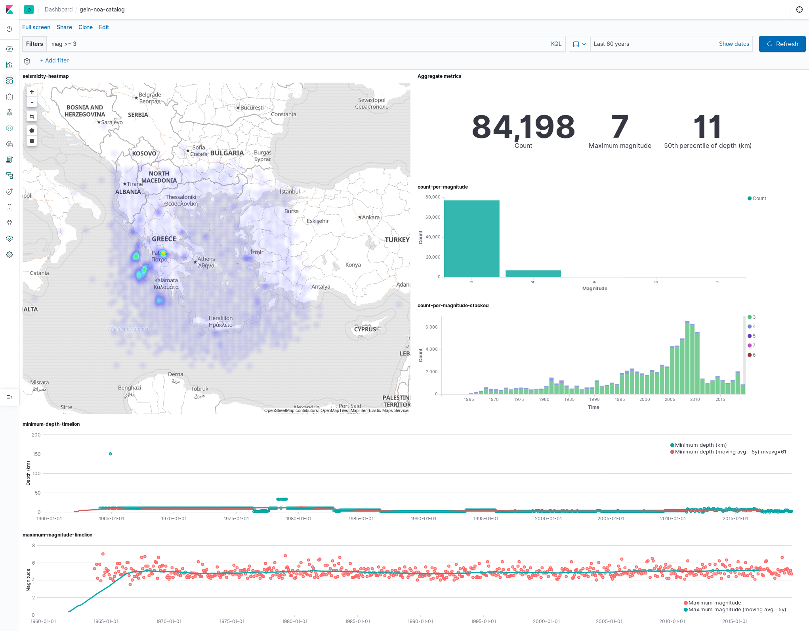
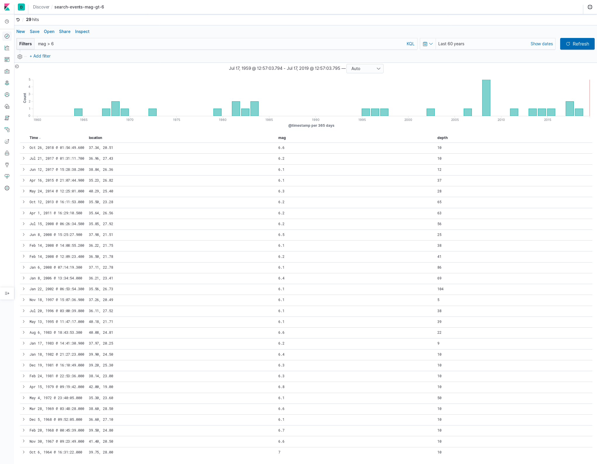

# Using the Elastic stack to process seismicity data in Greece

This is a simple demonstration of the use of ElasticSearch, Kibana, Logstash,
and Filebeat, to index and post-process seismicity data in Greece.

It is inspired by the following official tutorials:

* [Earthquake data with the Elastic Stack][elk-demo-full]
* [Elasticon tour 16 demo][elasticon16-demo]

I have made a [fork][personal-fork-dev] of the latter to implement the steps
with ELK 7.2 in Docker. This demonstration follows the docker implementation.

## Data source

The seismicity data include events logged from 1964 and up to this date,
downloaded from the site of the Institute of Geodynamics of the National
Observatory of Athens ([link][gein-noa-source]).

## System requirements

* `docker`
* `docker-compose`

## Use the Elastic Stack

We will use `docker-compose` to start the necessary services in each step of the
process. Here is a map of the services and the respective operations:

* **Elasticsearch**: Indexing, search, and analysis
* **Filebeat**: Collect the data.
* **Logstash**: Invoke the pipeline
  - Collect the data through **Filebeat**
  - Transform the data through built-in plugins.
  - Index the data through **ElasticSearch**.
* **Kibana**: Explore and visualize the indexed data.

### Summary of operations

* Invoke the pipeline

    $ docker-compose up logstash

  This starts also the `es0` service, that is the elasticsearch server,
  at http://localhost:9200.

* Start harvesting the data

  Once `logstash` is up and running, you can start the `filebeat`
  service

        $ docker-compose up filebeat

  You can monitor the creation of the index by direct calls to Elasticsearch
  API, like so:

        $ curl -XGET 'localhost:9200/\_cat/indices?v'
        health status index                uuid                   pri rep docs.count docs.deleted store.size pri.store.size
        green  open   gein-noa-earthquakes bWjO5dKQRuujui\_N-Dk-4w   1   0     276401 0     67.6mb         67.6mb

  This is the final count (i.e. 276401) of document for this particular example.

* Explore and visualize in Kibana

        $ docker-compose up -d kibana

  Visit http://localhost:5601 and perform the following:

  - Create an index-pattern **gein-noa-earthquakes** to explore (`Management -> Index Patterns`)
  - Import the saved objects (`*.ndjson`) from `kibana-objects/`
    (`Management -> Saved Objects`)
  - Select the `gein-noa-catalog` dashboard to have an overview of the data

    

    Each visualization can be reviewed and modified either by editing the
    dashboard and selecting the panel of interest for further editing, or
    by directly editing the visualization of choice through the `Saved Objects`
    pane of the application.

  - Select the `search-events-mag-gt-6` saved object to see an example of a
    search query.

    

### More on configuring the services

Each service hat its own configuration details that are well documented in the
respective guides. For this demonstration it was necessary to customize the
configuration of **Filebeat** and **Logstash** as follows:

#### Filebeat

The custom configuration is specified in `filebeat.yml` that reads:

    filebeat.inputs:
    - type: log
      paths:
        - data/gein-noa-catalog.txt

> NOTE: The path `data/` refers to the `filebeat` container created through
> `docker-compose` (see `docker-compose.yml`), and represents the centralized
> location where our data logs should be stored.

    output.logstash:
      hosts: ["logstash:5044"]

> NOTE: The `logstash:5044` endpoint is reachable only through the network created by
> Docker, which is exposed to the service containers.

More details on how to configure filebeat [here][configuring-filebeat]

#### Logstash

The pipeline is configured in `pipeline/gein-noa-catalog.conf` and includes
three stages: `input - filter - output`.

##### Input

The `input` stages specifies the source of the data to be processed. In this case
we expect `Filebeat` to harvest the data and pass it to `logstash:5044`. To this
end we expose the `logstash` service internally at port `5044`.

    input {
         beats {
            port => 5044
         }
    }

See more on the available input-plugins [here][logstash-input-plugins].

##### Filter

The raw data transmitted through `filebeat` are not in a form useful for
indexing. To transform them into a collection of the desired key-values
we may use the most suitable among the available filter plugins provided
with the installation of logstash (see [here][logstash-filter-plugins]).

The raw data in `data/gein-noa-catalog.txt` resemble a csv, but since they were
scraped the do not conform to a layout of values separated by a single
delimiter. If that was the case we could use the `csv` plugin.

Instead we use the `dissect` plugin, that is best suited for processing
rows of the same structure, where tokens are separated by various delimiters
including padding. An more expensive alternative (in terms of performance) is
`grok` that uses regular expressions to extract the desired tokens.

    filter {
        dissect {
            mapping => {
                "message" => " %{date} %{+date->} %{+date->} %{+date->} %{+date->} %{+date->} %{latitude->} %{longitude->} %{depth->} %{mag}"
            }
            convert_datatype => {
                "depth" => "float"
                "mag" => "float"
                "latitude" => "float"
                "longitude" => "float"
            }
        }
        mutate{
          add_field => ["location", "%{latitude}, %{longitude}"]
          remove_field => ["latitude", "longitude"]
        }
        date {
          match => ["date", "yyyy MMM d HH mm ss.S", "ISO8601"]
          target => "@timestamp"
          remove_field => ["date"]
        }
    }

This stages includes data-conversions (through the `dissect` plugin), field
mutation throught the `mutate` plugin, and date conversion through the `date`
plugin. By _field_ we refer here to a particular key in the document.

##### Output

Finally, Logstash passes the trasmitted and filtered data to an output
of our choice. Since we want to index the created documents in elasticsearch
we select the `elasticsearch` output plugin, where among other things we specify
the name of the index to be created, and the template that defines how a
document and the associated fields created in the previous stage are stored and
indexed in elasticsearch (more on mappings [here][es-mappings]).

    output {
    #     stdout { codec => rubydebug { metadata => true } }
        stdout { codec => dots }
        elasticsearch {
          hosts => ["http://elasticsearch:9200"]
          index => "gein-noa-earthquakes"
          template => "templates/gein-noa-catalog-template.json"
          template_name => "gein-noa-earthquakes"
          template_overwrite => true
        }
    }

> NOTE: The `stdout` plugin is facilitated in parallel to the indexing process
> to provide a visual overview on the process.

More on output plugins [here][logstash-output-plugins].

## References

* [Institute of Geodynamics - National Observatory of Athens][noa]
* [Elasticsearch docs][es-docs]
* [Logstash docs][logstash-docs]
* [Kibana docs][kibana-docs]
* [Filebeat docs][filebeat-docs]

[noa]: http://www.gein.noa.gr/en/
    "Institute of Geodynamics - National Observatory of Athens"
[elk-demo-full]: https://www.elastic.co/blog/earthquake-data-with-the-elastic-stack
    "Earthquake data with the Elastic Stack"
[elasticon16-demo]: https://github.com/tbragin/elasticon_tour16_demo
    "ElasticON 16 Kibana demo"
[personal-fork-dev]: https://github.com/kodemartin/elasticon_tour16_demo/tree/docker-elk-7
[gein-noa-source]: http://www.gein.noa.gr/en/seismicity/earthquake-catalogs
    "Earthquake catalog since 1964"
[configuring-filebeat]: https://www.elastic.co/guide/en/beats/filebeat/current/configuring-howto-filebeat.html
    "Configuring filebeat"
[logstash-input-plugins]: https://www.elastic.co/guide/en/logstash/current/input-plugins.html
    "Logstash input plugins"
[logstash-filter-plugins]: https://www.elastic.co/guide/en/logstash/current/filter-plugins.html
    "Logstash filter plugins"
[logstash-output-plugins]: https://www.elastic.co/guide/en/logstash/current/output-plugins.html
    "Logstash output plugins"
[es-mappings]: https://www.elastic.co/guide/en/elasticsearch/reference/current/mapping.html
    "Elasticsearch mapping"
[es-docs]: https://www.elastic.co/guide/en/elasticsearch/reference/current/index.html
    "Elasticsearch documentation"
[logstash-docs]: https://www.elastic.co/guide/en/logstash/current/index.html
    "Logstash documentation"
[kibana-docs]: https://www.elastic.co/guide/en/kibana/current/index.html
    "Kibana documentation"
[filebeat-docs]: https://www.elastic.co/guide/en/beats/filebeat/current/index.html
    "Filebeat documentation"
